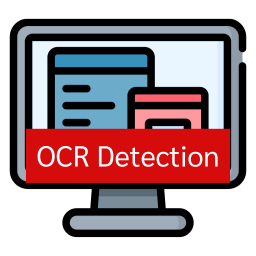
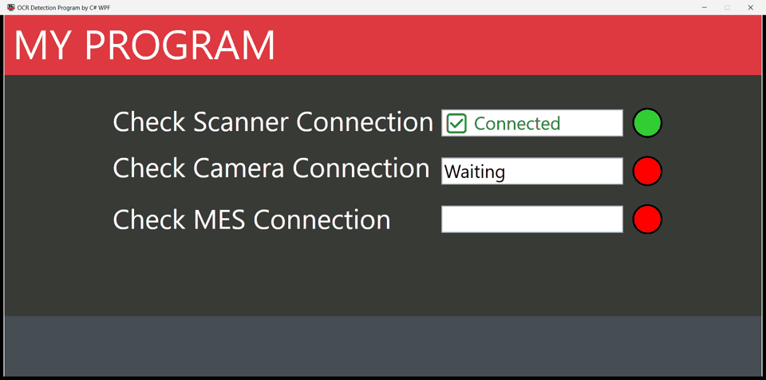
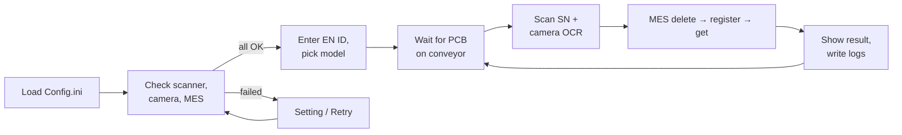

<div align="center">



# Machine Program

**Scan the board, read the label, register it to MES — one station, one window.**

WPF desktop apps for factory test/assembly stations. Each app talks to a barcode scanner, a vision camera and an MES server (plus a PLC in one variant), then logs pass/fail results.


<br />



<sub>Connection checks → enter EN ID → PCB arrives → scan + OCR → register to MES. Recorded against simulated scanner, camera and MES.</sub>

</div>

---

## Features

| | |
|---|---|
| **Startup device check** | Verifies the scanner (TCP), camera (TCP) and MES (HTTPS) are reachable before the run page unlocks. LEDs show live status per device. |
| **PLC interlock** | The PLC variant also confirms the E-Stop is released and the PLC answers over serial (RS-232/RS-485). |
| **Scan + OCR** | Triggers the code scanner and the vision camera, then shows serial number and OCR text side by side. |
| **MES registration** | Deletes, registers and re-reads the record by SN, and marks the board `OK` only if MES returns the OCR data it was sent. |
| **Per-model parameters** | `MODEL1` / `MODEL2` select which RD codes are registered, read from `Config.ini`. |
| **Run logs** | Daily text log of every result, plus an XML log of each MES request/response with timing. Both open from buttons in the UI. |
| **Retry / Setting** | If a device is down, the Setting and Retry buttons let the operator fix the config and re-check without restarting. |

## How it works



1. **Startup check** (`MainWindow.CheckConnection`) — loads `Config.ini` and checks each device in turn.
2. **Operator login** (`Page2`) — enter the EN ID and choose the product model.
3. **Run loop** (`Page3` → `MODEL1` / `MODEL2`) — wait for the photo sensor, scan the serial number, trigger the camera, push to MES, compare the response.
4. **Result handling** — `MES.cs` calls the shopfloor URLs from `Config.ini`; `Logfile.cs` writes the text and XML logs.

## Projects

| Folder | Target | Description |
|---|---|---|
| [`1.Machine(PLC)`](1.Machine(PLC)) | .NET 8 WPF | Station with a PLC in the loop. Confirms E-Stop released and PLC reachable via serial before allowing a run. |
| [`2.Machine(Non-PLC)`](2.Machine(Non-PLC)) | .NET 8 WPF | Same station workflow, no PLC dependency. |

Both projects share the same file layout and communication classes.

## Quick start

### Requirements

- Windows, .NET 8 SDK (WPF)
- Reachable scanner, camera and MES endpoints — or equivalents on localhost for a dry run

### Configure

Each project reads `Config.ini` next to the executable. Update `comport`, IPs, ports and paths for the target machine before running:

```ini
[PLC]
comport = COM9
buadrate = 9600
device = EE

[MES]
ip = <mes-host>
Current_Station = 250000

[SR_X300W_1]      ; scanner
ip = 192.168.100.5
Port = 9004

[CV-X490F_1]       ; Keyence vision camera
ip = 192.168.1.24
Port = 8500

[Path]
Log = <local log folder>
MES_Log = <mes log folder>

[URL]
Regist_Data = /des/elm/getparameter.asp?...
```

### Build & run

```bash
cd "1.Machine(PLC)"        # or "2.Machine(Non-PLC)"
dotnet restore
dotnet build
dotnet run
```

Or open `Program_CT.sln` in Visual Studio 2022+.

## Project layout

```
MainWindow.xaml.cs      app shell, page navigation, connection-check loop
Page1 / Page2 / Page3   status checks → EN ID + model → run view
Led.xaml                connection status indicator
PLC_comunication.cs     serial commands to the PLC (E-Stop check, bit read/write)
TCP_Communication.cs    raw TCP client for the scanner and camera
MES.cs                  HTTP client for the MES shopfloor API
Logfile.cs / Readfile.cs  run-log writer and Config.ini reader
MODEL1.cs / MODEL2.cs   per-model run loops and RD codes
Config.ini              devices, URLs, log paths (copied next to the exe)
docs/media/             demo GIF
```

## MES calls

Paths come from `[URL]` in `Config.ini`; the base host is `[MES] ip`.

| Key | Purpose |
|---|---|
| `getstation` | Startup reachability check |
| `Delete_data` | Remove any existing record for the SN |
| `Regist_Data` | Register SN + RD code + OCR data |
| `Get_Data` | Read back the record to verify the OCR data matches |
